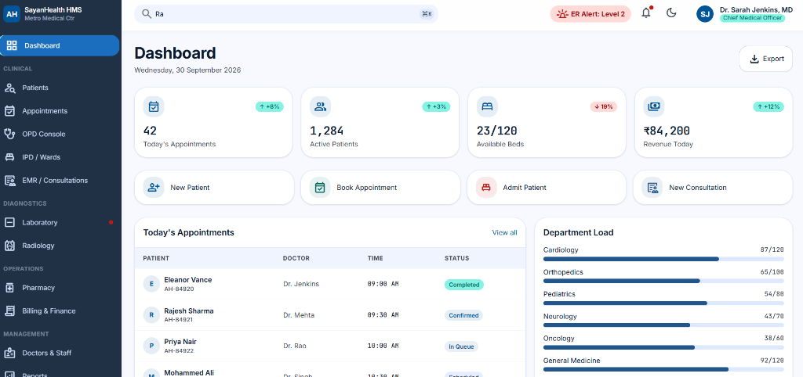
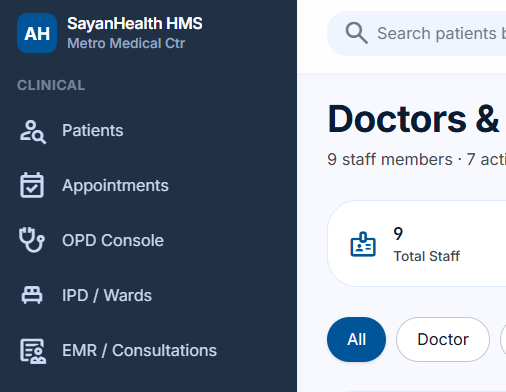
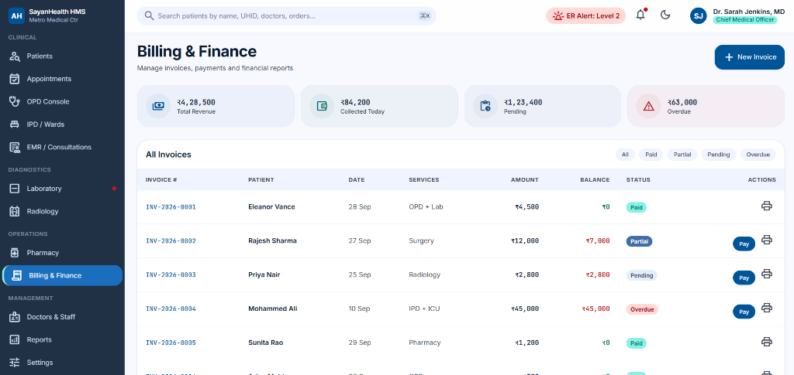

# 🏥 SayanHealth HMS (Hospital Management System)

A state-of-the-art, full-stack Hospital Management System designed with clinical precision and modern web architecture. SayanHealth HMS provides a comprehensive suite of tools for patient management, clinical records, billing, laboratory, and staff operations.

## ✨ Features

- **Dashboard:** Real-time KPIs, department load charts, and quick-action commands (Admit, Register, Book, etc).
- **Patient Management:** Comprehensive patient registration with demographics, emergency contacts, and medical history. Auto-generation of UHID.
- **Appointments & OPD:** Time-slot based booking, doctor scheduling, real-time queue management, and vitals recording.
- **IPD & Wards:** Visual bed management, real-time occupancy updates, and intuitive patient admission workflows.
- **EMR (Electronic Medical Records):** Advanced SOAP notes editor, ICD-10 diagnosis search, and dynamic prescription builder with dosage calculators.
- **Pharmacy POS:** Integrated POS system with real-time stock validation, barcode scanning, GST calculations, and multi-mode payment collection (Cash, UPI, Card).
- **Laboratory & Radiology:** Specialized modules for tracking orders, sample collection, reporting, and priority-based (STAT/Urgent/Routine) execution.
- **Billing & Finance:** Centralized invoice generation, payment tracking, partial payment handling, and revenue analytics.
- **Staff Management:** Complete staff directory, role-based access profiles, and scheduling.

## 🛠️ Technology Stack

**Frontend (Client)**
- **Framework:** React 18 with Vite
- **Styling:** Tailwind CSS v4
- **Routing:** React Router v6
- **Design System:** Material Symbols (Google Fonts), Inter & JetBrains Mono typography
- **Architecture:** Feature-based modular structure

**Backend (API)**
- **Runtime:** Node.js
- **Framework:** Express.js (v5 compatible router)
- **Database:** MongoDB (Mongoose ODM) with `mongodb-memory-server` fallback for zero-config development.
- **Language:** TypeScript
- **Auth:** JWT (JSON Web Tokens) with secure HttpOnly cookies

## 📸 Interface Preview

*(The SayanHealth UI employs a sophisticated design language utilizing semantic color mapping, elevated surfaces, and high-contrast typography, with a built-in dark mode toggle.)*

### Dashboard


### Sidebar / Staff View


### Billing & Finance


## 🚀 Getting Started

### Prerequisites
- Node.js (v18 or higher)
- npm or yarn

### 1. Installation

Clone the repository and install dependencies for both frontend and backend:

```bash
# Install backend dependencies
cd backend
npm install

# Install frontend dependencies
cd ../frontend
npm install
```

### 2. Running Locally (Development)

This project uses an in-memory MongoDB database by default for easy evaluation. No database setup is required.

**Start the Backend:**
```bash
cd backend
npm run dev
```
*(Runs on http://localhost:5000)*

**Start the Frontend:**
```bash
cd frontend
npm run dev
```
*(Runs on http://localhost:5173)*

### 3. Seed Database (Optional)
To populate the system with dummy data (patients, medicines, doctors, beds):
```bash
curl -X POST http://localhost:5000/api/v1/seed
```

## 🔐 Environment Variables

Create a `.env` file in the `backend/` directory:

```env
PORT=5000
NODE_ENV=development
MONGO_URI=your_mongodb_connection_string  # Optional: Omit to use memory-server
JWT_SECRET=supersecretkey
JWT_EXPIRE=30d
```

## 👨‍💻 Developed By
**Sayan Pal (sayanpal514-hue)**
